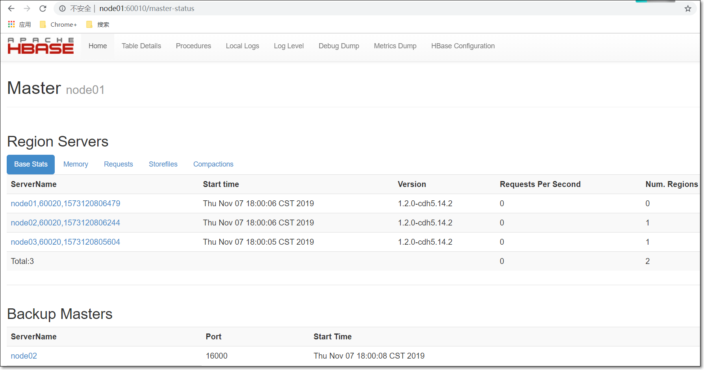

# 大数据数据库之HBase

# 一、课前准备

1. 安装好对应版本的hadoop集群，并启动

2. 安装好对应版本的zookeeper集群，并启动

# 二、课堂主题

本堂课主要围绕HBase的基础知识点进行讲解。主要包括以下几个方面

5. HBase的安装部署

# 三、课堂目标

5. 掌握HBase的安装部署


# 四、知识要点

## 1. HBase集群安装部署（10分钟）

### 1.1 准备安装包

- 下载安装包并上传到node01服务器

- 安装包下载地址：

  http://archive.cloudera.com/cdh5/cdh/5/hbase-1.2.0-cdh5.14.2.tar.gz

- 将安装包上传到node01服务器/kkb/soft路径下，并进行解压

```shell
[hadoop@node01 ~]$ cd /kkb/soft/
[hadoop@node01 soft]$ tar -xzvf hbase-1.2.0-cdh5.14.2.tar.gz -C /kkb/install/
```

### 1.2 修改HBase配置文件

#### 1.2.1 hbase-env.sh

- 修改文件

```shell
[hadoop@node01 soft]$ cd /kkb/install/hbase-1.2.0-cdh5.14.2/conf/
[hadoop@node01 conf]$ vim hbase-env.sh
```

- 修改如下两项内容，值如下

```shell
export JAVA_HOME=/kkb/install/jdk1.8.0_141
export HBASE_MANAGES_ZK=false
```


#### 1.2.2 hbase-site.xml

- 修改文件

```shell
[hadoop@node01 conf]$ vim hbase-site.xml
```

- 内容如下

```xml
<configuration>
	<property>
		<name>hbase.rootdir</name>
		<value>hdfs://node01:8020/hbase</value>  
	</property>
	<property>
		<name>hbase.cluster.distributed</name>
		<value>true</value>
	</property>
	<!-- 0.98后的新变动，之前版本没有.port,默认端口为60000 -->
	<property>
		<name>hbase.master.port</name>
		<value>16000</value>
	</property>
	<property>
		<name>hbase.zookeeper.quorum</name>
		<value>node01,node02,node03</value>
	</property>
    <!-- 此属性可省略，默认值就是2181 -->
	<property>
		<name>hbase.zookeeper.property.clientPort</name>
		<value>2181</value>
	</property>
	<property>
		<name>hbase.zookeeper.property.dataDir</name>
		<value>/kkb/install/zookeeper-3.4.5-cdh5.14.2/zkdatas</value>
	</property>
    <!-- 此属性可省略，默认值就是/hbase -->
	<property>
		<name>zookeeper.znode.parent</name>
		<value>/hbase</value>
	</property>
</configuration>
```

#### 1.2.3 regionservers

- 修改文件

```shell
[hadoop@node01 conf]$ vim regionservers
```

- 指定HBase集群的从节点；原内容清空，添加如下三行

```properties
node01
node02
node03
```

#### 1.2.4 back-masters

- 创建back-masters配置文件，里边包含备份HMaster节点的主机名，每个机器独占一行，实现HMaster的高可用

```shell
[hadoop@node01 conf]$ vim backup-masters
```

- 将node02作为备份的HMaster节点，问价内容如下

```properties
node02
```

### 1.3 分发安装包

- 将node01上的HBase安装包，拷贝到其他机器上

```shell
[hadoop@node01 conf]$ cd /kkb/install
[hadoop@node01 install]$ scp -r hbase-1.2.0-cdh5.14.2/ node02:$PWD
[hadoop@node01 install]$ scp -r hbase-1.2.0-cdh5.14.2/ node03:$PWD
```

### 1.4 创建软连接

- **<font color='red'>注意：三台机器</font>**均做如下操作

- 因为HBase集群需要读取hadoop的core-site.xml、hdfs-site.xml的配置文件信息，所以我们==三台机器==都要执行以下命令，在相应的目录创建这两个配置文件的软连接

```shell
ln -s /kkb/install/hadoop-2.6.0-cdh5.14.2/etc/hadoop/core-site.xml  /kkb/install/hbase-1.2.0-cdh5.14.2/conf/core-site.xml

ln -s /kkb/install/hadoop-2.6.0-cdh5.14.2/etc/hadoop/hdfs-site.xml  /kkb/install/hbase-1.2.0-cdh5.14.2/conf/hdfs-site.xml
```

- 执行完后，出现如下效果，以node01为例


### 1.5 添加HBase环境变量

- **<font color='red'>注意：三台机器</font>**均执行以下命令，添加环境变量

```shell
sudo vim /etc/profile
```

- 文件末尾添加如下内容

```shell
export HBASE_HOME=/kkb/install/hbase-1.2.0-cdh5.14.2
export PATH=$PATH:$HBASE_HOME/bin
```

- 重新编译/etc/profile，让环境变量生效

```shell
source /etc/profile
```

### 1.6 HBase的启动与停止

- <font color='red'>需要提前启动HDFS及ZooKeeper集群</font>

- 第一台机器node01（HBase主节点）执行以下命令，启动HBase集群

```shell
[hadoop@node01 ~]$ start-hbase.sh
```

- 启动完后，jps查看HBase相关进程

  node01、node02上有进程HMaster、HRegionServer

  node03上有进程HRegionServer

- 警告提示：HBase启动的时候会产生一个警告，这是因为jdk7与jdk8的问题导致的，如果linux服务器安装jdk8就会产生这样的一个警告


-  可以注释掉**所有机器**的hbase-env.sh当中的

  “HBASE_MASTER_OPTS”和“HBASE_REGIONSERVER_OPTS”配置 来解决这个问题。

  不过警告不影响我们正常运行，可以不用解决

- 我们也可以执行以下命令，单节点启动相关进程

```shell
#HMaster节点上启动HMaster命令
hbase-daemon.sh start master

#启动HRegionServer命令
hbase-daemon.sh start regionserver
```

### 1.7 访问WEB页面

- 浏览器页面访问

  http://node01:60010



### 1.8 停止HBase集群

- 停止HBase集群的正确顺序
- node01上运行

```shell
[hadoop@node01 ~]$ stop-hbase.sh
```

- 若需要关闭虚拟机，则还需要关闭ZooKeeper、Hadoop集群

  


