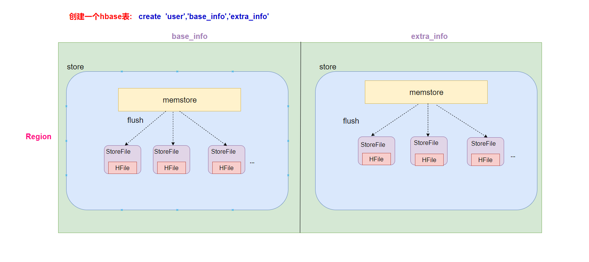
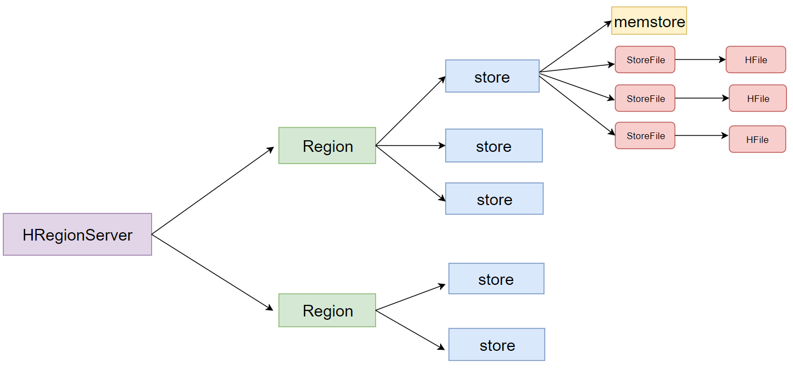
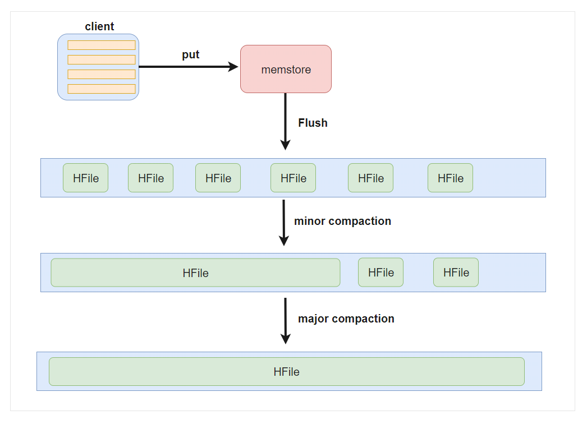
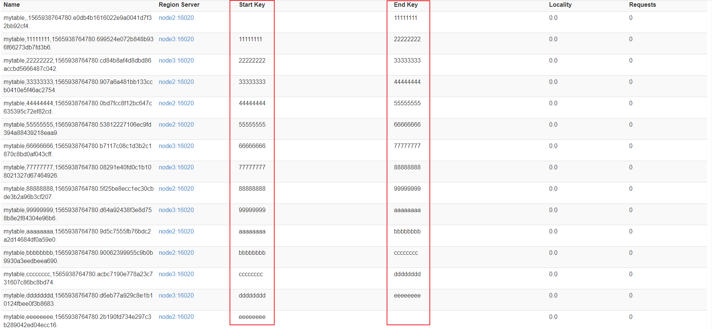
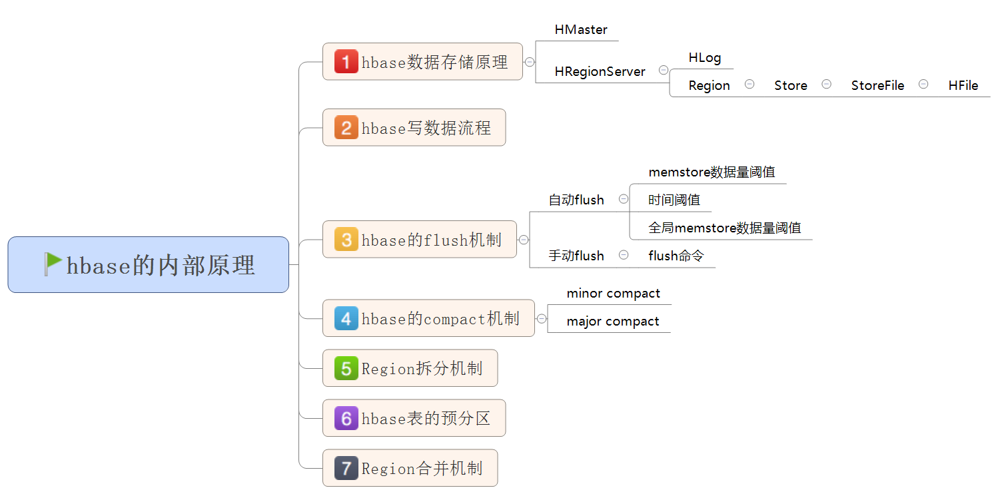

#  大数据数据库之HBase

# 一、课前准备

1. 安装好对应版本的HBase集群
2. 掌握HBase基本的shell操作

# 二、课堂主题

本堂课主要围绕HBase的原理性知识点进行讲解。主要包括以下几个方面

1. HBase的数据存储原理
2. HBase的读流程
3. HBase的写流程
4. HBase的flush、compact机制
5. HBase表中的region拆分
6. HBase表中的region合并
7. HBase表的预分区

# 三、课堂目标

1. 掌握HBase的数据存储原理
2. 掌握HBase的读流程和写流程
3. 掌握HBase表的region拆分和合并
4. 掌握HBase表的预分区


# 四、知识要点

## 1. HBase的数据存储原理（20分钟）




* 一个HRegionServer会负责管理很多个region
* 一个**==region==**包含很多个==store==
  * 一个**==列族==**就划分成一个**==store==**
  * 如果一个表中只有1个列族，那么每一个region中只有一个store
  * 如果一个表中有N个列族，那么每一个region中有N个store
* ==一个store==里面只有==一个memstore==
  * memstore是一块**内存区域**，写入的数据会先写入memstore进行缓冲，然后再把数据刷到磁盘
* 一个store里面有很多个**==StoreFile==**, 最后数据是以很多个**==HFile==**这种数据结构的文件保存在HDFS上
  * StoreFile是HFile的抽象对象，如果说到StoreFile就等于HFile
  * ==每次memstore刷写数据到磁盘，就生成对应的一个新的HFile文件出来==




## 2. HBase读数据流程（10分钟）


> 说明：HBase集群，只有一张meta表，此表只有一个region，该region数据保存在一个HRegionServer上

* 1、客户端首先与zk进行连接；从zk找到meta表的region位置，即meta表的数据存储在某一HRegionServer上；客户端与此HRegionServer建立连接，然后读取meta表中的数据；meta表中存储了所有用户表的region信息，我们可以通过`scan  'hbase:meta'`来查看meta表信息
* 2、根据要查询的namespace、表名和rowkey信息。找到写入数据对应的region信息
* 3、找到这个region对应的regionServer，然后发送请求
* 4、查找并定位到对应的region
* 5、先从memstore查找数据，如果没有，再从BlockCache上读取
  * HBase上Regionserver的内存分为两个部分
    * 一部分作为Memstore，主要用来写；
    * 另外一部分作为BlockCache，主要用于读数据；
* 6、如果BlockCache中也没有找到，再到StoreFile上进行读取
  * 从storeFile中读取到数据之后，不是直接把结果数据返回给客户端，而是把数据先写入到BlockCache中，目的是为了加快后续的查询；然后在返回结果给客户端。


## 3. HBase写数据流程（25分钟）


* 1、客户端首先从zk找到meta表的region位置，然后读取meta表中的数据，meta表中存储了用户表的region信息

* 2、根据namespace、表名和rowkey信息。找到写入数据对应的region信息

* 3、找到这个region对应的regionServer，然后发送请求

* 4、把数据分别写到HLog（write ahead log）和memstore各一份

* 5、memstore达到阈值后把数据刷到磁盘，生成storeFile文件

* 6、删除HLog中的历史数据


~~~
补充：
HLog（write ahead log）：
	也称为WAL意为Write ahead log，类似mysql中的binlog,用来做灾难恢复时用，HLog记录数据的所有变更,一旦数据修改，就可以从log中进行恢复。
~~~


## 4. HBase的flush、compact机制



### 4.1 Flush触发条件

#### 4.1.1 memstore级别限制

- 当Region中任意一个MemStore的大小达到了上限（hbase.hregion.memstore.flush.size，默认128MB），会触发Memstore刷新。

```xml
<property>
	<name>hbase.hregion.memstore.flush.size</name>
	<value>134217728</value>
</property>
```

  #### 4.1.2 region级别限制

- 当Region中所有Memstore的大小总和达到了上限（hbase.hregion.memstore.block.multiplier * hbase.hregion.memstore.flush.size，默认 2* 128M = 256M），会触发memstore刷新。

```xml
<property>
	<name>hbase.hregion.memstore.flush.size</name>
	<value>134217728</value>
</property>
<property>
	<name>hbase.hregion.memstore.block.multiplier</name>
	<value>2</value>
</property>   
```

#### 4.1.3 Region Server级别限制

- 当一个Region Server中所有Memstore的大小总和超过低水位阈值hbase.regionserver.global.memstore.size.lower.limit*hbase.regionserver.global.memstore.size（前者默认值0.95），RegionServer开始强制flush；
- 先Flush Memstore最大的Region，再执行次大的，依次执行；
- 如写入速度大于flush写出的速度，导致总MemStore大小超过高水位阈值hbase.regionserver.global.memstore.size（默认为JVM内存的40%），此时RegionServer会阻塞更新并强制执行flush，直到总MemStore大小低于低水位阈值

```xml
<property>
	<name>hbase.regionserver.global.memstore.size.lower.limit</name>
	<value>0.95</value>
</property>
<property>
	<name>hbase.regionserver.global.memstore.size</name>
	<value>0.4</value>
</property>
```

#### 4.1.4 HLog数量上限

- 当一个Region Server中HLog数量达到上限（可通过参数hbase.regionserver.maxlogs配置）时，系统会选取最早的一个 HLog对应的一个或多个Region进行flush

#### 4.1.5 定期刷新Memstore

- 默认周期为1小时，确保Memstore不会长时间没有持久化。为避免所有的MemStore在同一时间都进行flush导致的问题，定期的flush操作有20000左右的随机延时。

#### 4.1.6 手动flush

- 用户可以通过shell命令`flush ‘tablename’`或者`flush ‘region name’`分别对一个表或者一个Region进行flush。

### 4.2 flush的流程

- 为了减少flush过程对读写的影响，将整个flush过程分为三个阶段：
  - prepare阶段：遍历当前Region中所有的Memstore，将Memstore中当前数据集CellSkipListSet做一个**快照snapshot**；然后再新建一个CellSkipListSet。后期写入的数据都会写入新的CellSkipListSet中。prepare阶段需要加一把updateLock对**写请求阻塞**，结束之后会释放该锁。因为此阶段没有任何费时操作，因此持锁时间很短。

  - flush阶段：遍历所有Memstore，将prepare阶段生成的snapshot持久化为**临时文件**，临时文件会统一放到目录.tmp下。这个过程因为涉及到磁盘IO操作，因此相对比较耗时。
  - commit阶段：遍历所有Memstore，将flush阶段生成的临时文件移到指定的ColumnFamily目录下，针对HFile生成对应的storefile和Reader，把storefile添加到HStore的storefiles列表中，最后再**清空**prepare阶段生成的snapshot。

### 4.3  Compact合并机制

- hbase为了==防止小文件过多==，以保证查询效率，hbase需要在必要的时候将这些小的store file合并成相对较大的store file，这个过程就称之为compaction。

- 在hbase中主要存在两种类型的compaction合并
  - **==minor compaction 小合并==**
  - **==major compaction 大合并==**

#### 4.3.1 minor compaction 小合并

- 在将Store中多个HFile合并为一个HFile

  在这个过程中会选取一些小的、相邻的StoreFile将他们合并成一个更大的StoreFile，对于超过了TTL的数据、更新的数据、删除的数据仅仅只是做了标记。并没有进行物理删除，一次Minor Compaction的结果是更少并且更大的StoreFile。这种合并的触发频率很高。

- minor compaction触发条件由以下几个参数共同决定：

~~~xml
<!--表示至少需要三个满足条件的store file时，minor compaction才会启动-->
<property>
	<name>hbase.hstore.compactionThreshold</name>
	<value>3</value>
</property>

<!--表示一次minor compaction中最多选取10个store file-->
<property>
	<name>hbase.hstore.compaction.max</name>
	<value>10</value>
</property>

<!--默认值为128m,
表示文件大小小于该值的store file 一定会加入到minor compaction的store file中
-->
<property>
	<name>hbase.hstore.compaction.min.size</name>
	<value>134217728</value>
</property>

<!--默认值为LONG.MAX_VALUE，
表示文件大小大于该值的store file 一定会被minor compaction排除-->
<property>
	<name>hbase.hstore.compaction.max.size</name>
	<value>9223372036854775807</value>
</property>
~~~

#### 4.3.2 major compaction 大合并

* 合并Store中所有的HFile为一个HFile

  将所有的StoreFile合并成一个StoreFile，这个过程还会清理三类无意义数据：被删除的数据、TTL过期数据、版本号超过设定版本号的数据。合并频率比较低，默认**7天**执行一次，并且性能消耗非常大，建议生产关闭(设置为0)，在应用空闲时间手动触发。一般可以是手动控制进行合并，防止出现在业务高峰期。
  
* major compaction触发时间条件

  ~~~xml
  <!--默认值为7天进行一次大合并，-->
  <property>
  	<name>hbase.hregion.majorcompaction</name>
  	<value>604800000</value>
  </property>
  ~~~

* 手动触发

  ~~~ruby
  ##使用major_compact命令
  major_compact tableName
  ~~~


## 5. HBase表的预分区

- 当一个table刚被创建的时候，Hbase默认的分配一个region给table。也就是说这个时候，所有的读写请求都会访问到同一个regionServer的同一个region中，这个时候就达不到负载均衡的效果了，集群中的其他regionServer就可能会处于比较空闲的状态。
- 解决这个问题可以用**pre-splitting**,在创建table的时候就配置好，生成多个region。

### 5.1 为何要预分区？

* 增加数据读写效率
* 负载均衡，防止数据倾斜
* 方便集群容灾调度region
* 优化Map数量

### 5.2 预分区原理

- 每一个region维护着startRow与endRowKey，如果加入的数据符合某个region维护的rowKey范围，则该数据交给这个region维护。

### 5.3 手动指定预分区

- 三种方式

- 方式一

~~~ruby
create 'person','info1','info2',SPLITS => ['1000','2000','3000','4000']
~~~


* 方式二：也可以把分区规则创建于文件中

  ~~~shell
  cd /kkb/install
  
  vim split.txt
  ~~~

  - 文件内容

  ~~~
  aaa
  bbb
  ccc
  ddd
  ~~~

  - hbase shell中，执行命令

  ~~~ruby
  create 'student','info',SPLITS_FILE => '/kkb/install/split.txt'
  ~~~

  - 成功后查看web界面

  

- 方式三： HexStringSplit 算法
  - HexStringSplit会将数据从“00000000”到“FFFFFFFF”之间的数据长度按照**n等分**之后算出每一段的其实rowkey和结束rowkey，以此作为拆分点。

  - 例如：

  ```ruby
  create 'mytable', 'base_info',' extra_info', {NUMREGIONS => 15, SPLITALGO => 'HexStringSplit'}
  ```




## 6. region 合并（10分钟）

### 6.1 region合并说明

- Region的合并不是为了性能,  而是出于维护的目的 .
- 比如删除了大量的数据 ,这个时候每个Region都变得很小 ,存储多个Region就浪费了 ,这个时候可以把Region合并起来，进而可以减少一些Region服务器节点 

### 6.2 如何进行region合并

#### 6.2.1 通过Merge类冷合并Region

- 执行合并前，==需要先关闭hbase集群==

- 创建一张hbase表：

```ruby
create 'test','info1',SPLITS => ['1000','2000','3000']
```

- 查看表region


- 需求：

  需要把test表中的2个region数据进行合并：
  test,,1565940912661.62d28d7d20f18debd2e7dac093bc09d8.
  test,1000,1565940912661.5b6f9e8dad3880bcc825826d12e81436.

- 这里通过org.apache.hadoop.hbase.util.Merge类来实现，**不需要**进入hbase shell，直接执行（==需要先关闭hbase集群==）：
  hbase org.apache.hadoop.hbase.util.Merge test test,,1565940912661.62d28d7d20f18debd2e7dac093bc09d8. test,1000,1565940912661.5b6f9e8dad3880bcc825826d12e81436.

- 成功后界面观察


#### 6.2.2  通过online_merge热合并Region

- ==不需要关闭hbase集群==，在线进行合并
- 与冷合并不同的是，online_merge的传参是Region的hash值，而Region的hash值就是Region名称的最后那段在两个.之间的字符串部分。
- 需求：需要把test表中的2个region数据进行合并：
  test,2000,1565940912661.c2212a3956b814a6f0d57a90983a8515.
  test,3000,1565940912661.553dd4db667814cf2f050561167ca030.

- 需要进入hbase shell：

  ```ruby
  merge_region 'c2212a3956b814a6f0d57a90983a8515','553dd4db667814cf2f050561167ca030'
  ```

- 成功后观察界面


# 五、拓展点、未来计划、行业趋势


# 六、总结




